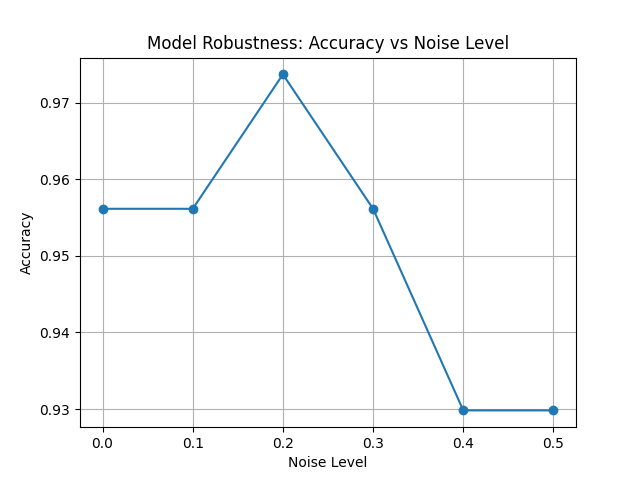

# ML Model Robustness Stress Tester

This project analyzes how robust a machine learning model is when faced with degraded or corrupted input data.
Instead of focusing only on accuracy, the project evaluates how model performance deteriorates under stress.

---

## 🔍 Problem Statement
Machine learning models often perform well on clean test data but fail silently in real-world scenarios where:
- input data is noisy
- measurements are imperfect
- data distributions shift

This project answers:
**How reliable is a model when the data quality worsens?**

---

## 🧠 Dataset
- Breast Cancer Wisconsin Dataset
- Built-in dataset from `scikit-learn`
- 569 samples, 30 numerical features
- Binary classification (benign vs malignant)

No external downloads required.

---

## ⚙️ Methodology

1. Load and inspect dataset
2. Train a baseline Logistic Regression model
3. Measure baseline accuracy on clean data
4. Inject Gaussian noise into test data
5. Evaluate accuracy degradation as noise increases
6. Visualize robustness using accuracy vs noise plots

---

## 📊 Results

The model performs well on clean data but shows a clear decline in accuracy as noise increases.

Key insight:
> High accuracy does not guarantee robustness.

The robustness plot clearly demonstrates how model reliability degrades under real-world stress conditions.



---

## 🛠️ Technologies Used
- Python
- scikit-learn
- NumPy
- Pandas
- Matplotlib

---

## 🚀 How to Run

```bash
pip install -r requirements.txt
python src/step1_load_data.py
python src/step2_train_baseline.py
python src/step3_noise_robustness.py
python src/step4_plot_noise_robustness.py
